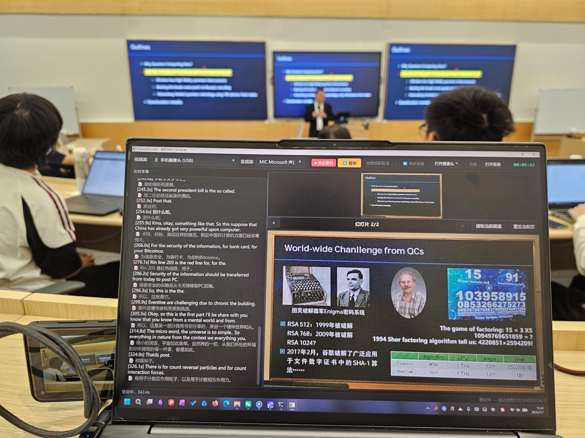
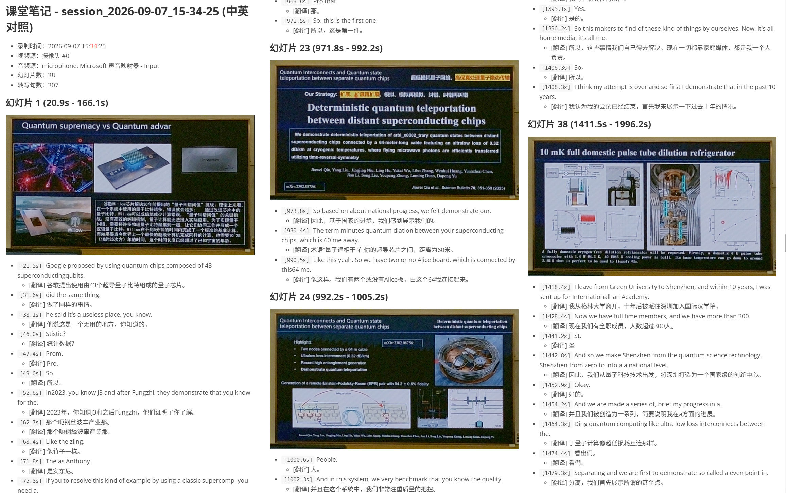

<p align="center">
  
</p>

# CourseRecorder · 课堂录课助手

<div align="center">

**一台电脑 + 一台摄像头 or 手机，搞定整堂课的 PPT 录制与语音转录**

[](https://www.python.org/)
[](https://github.com/)
[](./LICENSE)
[](https://pypi.org/project/PyQt5/)

[简体中文](#简体中文) | [English](#english) | 🌐 [项目主页](https://tewhac-china.github.io/CourseRecorder/)

</div>

> 📄 **项目介绍主页**：[**tewhac-china.github.io/CourseRecorder**](https://tewhac-china.github.io/CourseRecorder/)
> 完整的功能说明、AI 模型清单、GPU 配置需求与已知不足，单文件网页。
> 完整的功能说明、AI 模型清单、GPU 配置需求与已知不足，单文件网页，双击即可打开。

---

<a name="简体中文"></a>

## 简体中文

### 📖 项目简介

CourseRecorder 是一款面向**课堂/讲座/会议**场景的桌面录制工具。只需一台普通摄像头（笔记本内置、USB 外接、甚至闲置的安卓手机）对准投影幕布或白板，它就能：

- 🎯 **自动识别投影区域** —— 梯形校正，把斜拍的幕布"拉直"成正面图
- 🖼️ **自动提取幻灯片** —— 画面变化时自动截图，去重后按时间线排列
- 🎙️ **实时语音转写** —— 基于 Whisper，边录边出文字稿
- 🌏 **实时翻译** —— 可选接入 Qwen3 模型，转写后自动译为中文
- 📝 **生成课堂笔记** —— 幻灯片 + 转写文字整合成结构化笔记

**核心价值**：不需要昂贵的录播设备，用现成的摄像头就能产出「视频 + 幻灯片 + 文稿 + 笔记」的完整课程资料。

### 📸 效果展示

**真实课堂场景** —— 手机摄像头对准投影幕布，实时转写 + 自动提取幻灯片：



**自动生成的中英对照课堂笔记** —— 幻灯片截图 + 时间戳 + 双语转写：



### ✨ 主要功能

| 功能 | 说明 |
|------|------|
| **多视频源** | USB 外接摄像头、笔记本内置摄像头、安卓手机（USB 投流）、本地视频文件 |
| **投影区域标定** | 自动检测四角 · 手动点击标定 · 逐帧跟踪，实时透视矫正 |
| **幻灯片提取** | 基于感知哈希的画面变化检测，自动去重，按时间线整理 |
| **实时转写** | Whisper 本地模型（tiny ~ large 可选），支持 CUDA 加速 |
| **实时翻译** | Qwen3-1.7B int4 量化模型，英文转写实时译为中文 |
| **录制输出** | 视频、音频、幻灯片图片、Markdown 笔记，分目录存放 |
| **手机摄像头** | 通过 adb USB 通道获取手机摄像头原生最高分辨率画面（实测 3264×2448） |
| **摄像头参数调节** | 亮度 / 对比度 / 饱和度 / 色调 / 曝光，自动探测可用范围 |

### 🚀 快速开始

#### 1. 环境要求

- Python 3.9+（推荐 Anaconda / Miniconda）
- Windows 10/11（Linux/macOS 未完整测试）
- 可选：NVIDIA GPU + CUDA（大幅加速转写与翻译）

#### 2. 安装依赖

```bash
# 创建虚拟环境（推荐）
conda create -n courserecorder python=3.11
conda activate courserecorder

# 安装依赖
pip install -r requirements.txt
```

> ⚠️ **首次运行会自动下载 Whisper 模型**（几百 MB ~ 数 GB，取决于所选模型大小）。
> 翻译功能默认关闭，开启后会额外下载 Qwen3-1.7B 模型。

#### 3. 启动

```bash
python main.py
```

或直接双击 **`run.bat`**（Windows）／执行 **`run.ps1`**（PowerShell）。

#### 4. 使用流程

1. **选择视频源** —— 顶部下拉框选择摄像头（或手机摄像头、视频文件）
2. **打开摄像头** —— 点击蓝色「打开摄像头」按钮，按钮变黄（连接中）→ 变绿（已连接）
3. **标定投影区域**（可选）—— 点「标定投影区域」，手动点击幕布四角，或直接用自动检测
4. **开始录制** —— 点「● 开始录制」
5. **停止并查看** —— 点「■ 停止录制」，输出自动保存到 `outputs/` 并按日期分目录

### 📱 安卓手机作为高清摄像头

闲置的安卓手机可以变成一台**高清 USB 摄像头**，分辨率远超普通摄像头。

```bash
# 1. 手机开启「开发者选项 → USB 调试」，用数据线连电脑
# 2. 构建并安装 APK（需要 JDK + Android SDK，详见 ADB/NativeCam/README.md）
cd ADB/NativeCam
build.bat

adb install -r build\nativecam.apk
adb shell pm grant com.nativecam.bridge android.permission.CAMERA
adb shell am start-foreground-service -n com.nativecam.bridge/.CameraService
adb forward tcp:8888 tcp:8888

# 3. 验证
python pc\nativecam.py info
```

然后在 CourseRecorder 主界面选择「手机摄像头」即可。

> 📂 手机端源码位于 [`ADB/NativeCam/`](./ADB/NativeCam)，含完整 Java 源码与 PC 端 Python 客户端。
> 详细构建说明见 [ADB/NativeCam/README.md](./ADB/NativeCam/README.md)。

### 📁 项目结构

```
CourseRecorder/
├── main.py                 # GUI 入口
├── cli.py                  # 命令行入口
├── run.bat / run.ps1       # 一键启动脚本
├── requirements.txt        # Python 依赖
├── CourseRecorder.spec     # PyInstaller 打包配置
│
├── src/
│   ├── app.py              # 应用启动与装配
│   ├── core/               # 核心业务逻辑
│   │   ├── media_source.py     # 视频源（摄像头/文件/手机）
│   │   ├── capture_worker.py   # 摄像头采集子进程（进程隔离防崩溃）
│   │   ├── audio_source.py     # 音频采集（麦克风/系统声音）
│   │   ├── screen_detector.py  # 投影区域检测与透视矫正
│   │   ├── slide_extractor.py  # 幻灯片变化检测与提取
│   │   ├── transcriber.py      # Whisper 语音转写
│   │   ├── translator.py       # Qwen3 翻译
│   │   ├── recorder.py         # 录制调度
│   │   ├── session.py          # 录制会话与输出管理
│   │   ├── nativecam_source.py # 手机摄像头数据源
│   │   └── config.py           # 配置管理
│   └── ui/                 # PyQt5 界面
│       ├── main_window.py          # 主窗口
│       ├── preview_widget.py       # 预览控件
│       ├── corner_calibration.py   # 角点标定对话框
│       ├── usb_camera_dialog.py    # USB 摄像头参数面板
│       ├── phone_camera_dialog.py  # 手机摄像头参数面板
│       ├── settings_dialog.py      # 全局设置
│       └── theme.py                # 主题样式
│
├── ADB/NativeCam/          # 安卓手机端客户端（Java 源码 + 构建脚本）
├── assets/                 # Logo 与示例图片
├── docs/                   # 项目介绍主页（GitHub Pages 自动部署，单文件网页）
├── tests/                  # 测试脚本
└── outputs/                # 录制输出（运行时生成，不入库）
```

### 🛠 技术栈

| 领域 | 技术 |
|------|------|
| 界面 | PyQt5 |
| 图像处理 | OpenCV、NumPy、Pillow |
| 画面去重 | imagehash（感知哈希）、SciPy |
| 语音转写 | openai-whisper（本地推理） |
| 翻译 | transformers + Qwen3-1.7B（int4 量化） |
| 音频采集 | soundcard、PyAudio、webrtcvad |
| 打包 | PyInstaller |
| 手机端 | Android Camera2 API + 本机 HTTP 服务（Java） |

### ⚙️ 打包为独立程序

```bash
pyinstaller CourseRecorder.spec
```

产物位于 `dist/CourseRecorder/`。

### ❓ 常见问题

**Q：摄像头画面黑屏 / 打不开？**
- 确认没有其他程序（如相机应用、腾讯会议）占用摄像头
- USB 摄像头尝试重新插拔
- 程序内置摄像头冲突检测与自动修复，会在状态栏提示

**Q：外接 USB 摄像头帧率很低、有果冻效应？**
- 程序会**自动协商 MJPG 格式**（多数 USB 摄像头在 YUY2 下仅 10fps，MJPG 可达 30fps）
- 若仍然卡顿，尝试在设置中降低分辨率

**Q：转写很慢？**
- Whisper 模型越大越慢但越准。建议：有 NVIDIA GPU 时用 `small`/`medium` + CUDA；
  纯 CPU 用 `tiny`/`base`
- 确认 PyTorch 安装的是 CUDA 版本

**Q：投影区域识别不准？**
- 点「标定投影区域」手动点击幕布四个角，比自动检测更可靠
- 确认幕布与周围墙壁有明显亮度/色彩对比

### 📄 许可证

本项目采用 **CC BY-NC-SA 4.0**（署名 - 非商业性使用 - 相同方式共享）许可协议。

- ✅ 允许：个人学习、研究、非营利教学使用、二次开发
- ❌ 禁止：**任何商业用途**（出售、收费服务、企业内部付费培训等）
- 📤 衍生作品必须以相同协议开源

完整条款见 [LICENSE](./LICENSE)。

> ⚠️ **免责声明**：本项目仅供学习交流使用。录制他人授课内容前，请务必获得授课者同意，
> 并遵守所在机构的规章制度与当地法律法规。因使用本项目产生的任何纠纷，作者不承担责任。

---

<a name="english"></a>

## English

### 📖 Overview

CourseRecorder is a desktop tool for **lectures, seminars, and meetings**. Point an ordinary camera — a laptop webcam, a USB camera, or even an idle Android phone — at the projection screen or whiteboard, and it will:

- 🎯 **Auto-detect the projection area** — keystone correction that "flattens" an obliquely shot screen
- 🖼️ **Auto-extract slides** — captures frames on content change, de-duplicates, arranges on a timeline
- 🎙️ **Real-time transcription** — powered by Whisper, produces text as you record
- 🌏 **Real-time translation** — optional Qwen3 model translating transcripts into Chinese
- 📝 **Generate lecture notes** — merges slides + transcript into structured notes

**Core value**: no expensive lecture-capture hardware needed — an existing camera yields a complete course package of *video + slides + transcript + notes*.

### 📸 Screenshots

**Real classroom** — a phone camera pointed at the screen, live transcription + auto slide extraction:


**Auto-generated bilingual lecture notes** — slide captures + timestamps + dual-language transcript:


### ✨ Features

| Feature | Description |
|---------|-------------|
| **Multiple sources** | USB camera, built-in webcam, Android phone (USB streaming), local video file |
| **Projection calibration** | Auto corner detection · manual click calibration · per-frame tracking, live perspective warp |
| **Slide extraction** | Perceptual-hash change detection, auto de-duplication, timeline arrangement |
| **Live transcription** | Local Whisper models (tiny ~ large), CUDA-accelerated |
| **Live translation** | Qwen3-1.7B int4 quantized model for EN→ZH |
| **Recording output** | Video, audio, slide images, Markdown notes, organized per session |
| **Phone as HD camera** | Streams the phone camera's native max resolution over adb USB (up to 3264×2448 measured) |
| **Camera controls** | Brightness / contrast / saturation / hue / exposure with auto-detected ranges |

### 🚀 Quick Start

#### 1. Requirements

- Python 3.9+ (Anaconda / Miniconda recommended)
- Windows 10/11 (Linux/macOS not fully tested)
- Optional: NVIDIA GPU + CUDA (greatly accelerates transcription & translation)

#### 2. Install

```bash
conda create -n courserecorder python=3.11
conda activate courserecorder
pip install -r requirements.txt
```

> ⚠️ The Whisper model is downloaded automatically on first run (hundreds of MB to several GB
> depending on model size). Translation is off by default and downloads Qwen3-1.7B when enabled.

#### 3. Launch

```bash
python main.py
```

Or double-click **`run.bat`** (Windows) / run **`run.ps1`** (PowerShell).

#### 4. Workflow

1. **Pick a source** — choose a camera (or phone camera / video file) from the top dropdown
2. **Open camera** — click the blue **Open Camera** button; it turns yellow (connecting) then green (connected)
3. **Calibrate projection** (optional) — click **Calibrate Projection Area** and click the four screen corners, or just rely on auto-detection
4. **Record** — click **● Start Recording**
5. **Stop & review** — click **■ Stop Recording**; output is saved under `outputs/` in a dated folder

### 📱 Use an Android Phone as an HD Camera

An idle Android phone becomes a **high-resolution USB camera**, far exceeding typical webcams.

```bash
# 1. Enable "Developer options → USB debugging" on the phone and connect via USB
# 2. Build and install the APK (requires JDK + Android SDK; see ADB/NativeCam/README.md)
cd ADB/NativeCam
build.bat

adb install -r build\nativecam.apk
adb shell pm grant com.nativecam.bridge android.permission.CAMERA
adb shell am start-foreground-service -n com.nativecam.bridge/.CameraService
adb forward tcp:8888 tcp:8888

# 3. Verify
python pc\nativecam.py info
```

Then select **Phone Camera** in the CourseRecorder main window.

> 📂 Phone-side source lives in [`ADB/NativeCam/`](./ADB/NativeCam) with full Java sources
> and a Python PC client. See [ADB/NativeCam/README.md](./ADB/NativeCam/README.md) for details.

### 🛠 Tech Stack

| Area | Technology |
|------|------------|
| GUI | PyQt5 |
| Image processing | OpenCV, NumPy, Pillow |
| Frame de-duplication | imagehash (perceptual hash), SciPy |
| Transcription | openai-whisper (local inference) |
| Translation | transformers + Qwen3-1.7B (int4 quantized) |
| Audio capture | soundcard, PyAudio, webrtcvad |
| Packaging | PyInstaller |
| Phone client | Android Camera2 API + localhost HTTP service (Java) |

### ⚙️ Build a Standalone Executable

```bash
pyinstaller CourseRecorder.spec
```

Output is in `dist/CourseRecorder/`.

### ❓ FAQ

**Q: Black screen / cannot open the camera?**
- Make sure no other app (Camera app, Zoom, Teams) is holding the device
- For USB cameras, try unplugging and reconnecting
- Built-in conflict detection and auto-recovery report status in the status bar

**Q: USB camera framerate is low with a jelly/rolling-shutter effect?**
- The app **auto-negotiates MJPG** — many USB cameras run only 10 fps in YUY2 but reach 30 fps in MJPG
- If still choppy, lower the resolution in Settings

**Q: Transcription is slow?**
- Larger Whisper models are slower but more accurate. With an NVIDIA GPU use `small`/`medium` + CUDA;
  on CPU-only use `tiny`/`base`
- Verify your PyTorch build is the CUDA version

**Q: Projection area detection is inaccurate?**
- Click **Calibrate Projection Area** and manually click the four corners — more reliable than auto-detection
- Ensure the screen has clear brightness/color contrast against the surrounding wall

### 📄 License

Licensed under **CC BY-NC-SA 4.0** (Attribution-NonCommercial-ShareAlike).

- ✅ Allowed: personal learning, research, non-profit teaching, derivative works
- ❌ Prohibited: **any commercial use** (selling, paid services, in-house paid training, etc.)
- 📤 Derivative works must be released under the same license

Full terms in [LICENSE](./LICENSE).

> ⚠️ **Disclaimer**: This project is for learning and exchange only. Always obtain the
> instructor's consent before recording, and comply with your institution's policies and
> local laws. The authors accept no liability for any dispute arising from its use.

---

<div align="center">

**如果这个项目对你有帮助，欢迎 Star ⭐**

Made with ❤️ for students and educators

</div>
